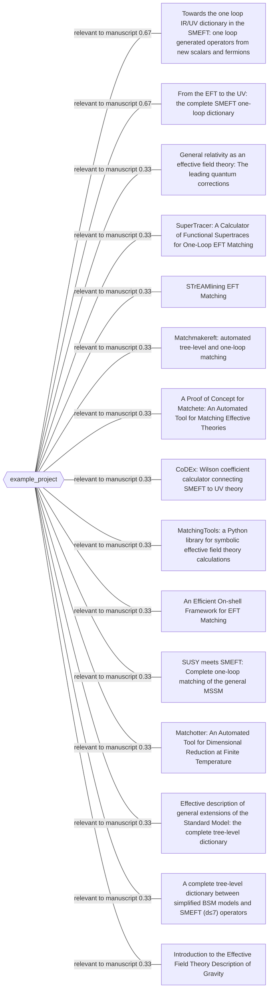

# Literature graph: example_project

| Related work | Relationship | Score | Shared research tags |
|---|---:|---:|---|
| Towards the one loop IR/UV dictionary in the SMEFT: one loop generated operators from new scalars and fermions | relevant_to_manuscript | 0.67 | automated_eft_matching, inverse_uv_reconstruction |
| From the EFT to the UV: the complete SMEFT one-loop dictionary | relevant_to_manuscript | 0.67 | automated_eft_matching, inverse_uv_reconstruction |
| General relativity as an effective field theory: The leading quantum corrections | relevant_to_manuscript | 0.33 | gravitational_eft |
| SuperTracer: A Calculator of Functional Supertraces for One-Loop EFT Matching | relevant_to_manuscript | 0.33 | automated_eft_matching |
| STrEAMlining EFT Matching | relevant_to_manuscript | 0.33 | automated_eft_matching |
| Matchmakereft: automated tree-level and one-loop matching | relevant_to_manuscript | 0.33 | automated_eft_matching |
| A Proof of Concept for Matchete: An Automated Tool for Matching Effective Theories | relevant_to_manuscript | 0.33 | automated_eft_matching |
| CoDEx: Wilson coefficient calculator connecting SMEFT to UV theory | relevant_to_manuscript | 0.33 | automated_eft_matching |
| MatchingTools: a Python library for symbolic effective field theory calculations | relevant_to_manuscript | 0.33 | automated_eft_matching |
| An Efficient On-shell Framework for EFT Matching | relevant_to_manuscript | 0.33 | automated_eft_matching |
| SUSY meets SMEFT: Complete one-loop matching of the general MSSM | relevant_to_manuscript | 0.33 | automated_eft_matching |
| Matchotter: An Automated Tool for Dimensional Reduction at Finite Temperature | relevant_to_manuscript | 0.33 | automated_eft_matching |
| Effective description of general extensions of the Standard Model: the complete tree-level dictionary | relevant_to_manuscript | 0.33 | inverse_uv_reconstruction |
| A complete tree-level dictionary between simplified BSM models and SMEFT (d≤7) operators | relevant_to_manuscript | 0.33 | inverse_uv_reconstruction |
| Introduction to the Effective Field Theory Description of Gravity | relevant_to_manuscript | 0.33 | gravitational_eft |

Scores describe this curated local corpus, not global scholarly importance.
